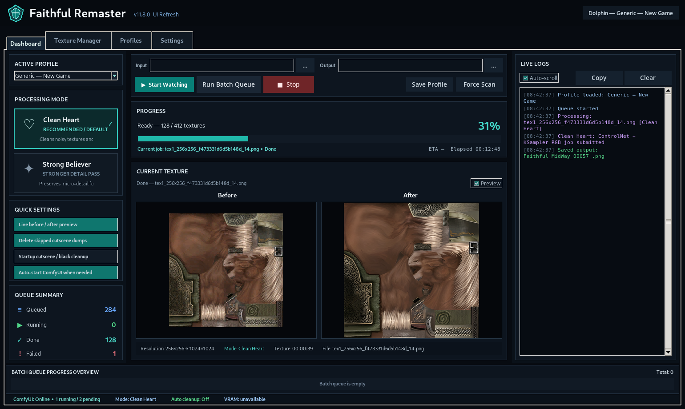

# Faithful Remaster v11.10.31

**Faithful Remaster** is a Windows texture-remastering workspace for emulator texture packs. It watches emulator dump folders, sends textures through replaceable ComfyUI workflows, writes finished files into the emulator load/replacement folder, and helps you audit missing, existing, orphaned, quarantined, cached, and ready textures.

Faithful Remaster is not an emulator, not a model downloader, and not a one-click guarantee that every texture in every game will look perfect. It is a controlled production workspace for texture-pack creation.



## Download

Latest version: **Faithful Remaster v11.10.31**

Download the Windows ZIP from the latest GitHub Release and extract it into a normal folder, for example:

```text
D:\Tools\Faithful Remaster\
```

Then run:

```text
Faithful Remaster.exe
```

If Windows blocks the app because it is unsigned, choose **More info → Run anyway** only if you downloaded it from the official release page.

## What this tool is for

Use Faithful Remaster when you want to:

- monitor a game's dump folder while playing;
- remaster newly dumped textures automatically;
- preserve original emulator filenames and folder structure;
- compare output modes before replacing game textures;
- build multiple game packs through Batch Queue;
- review missing, existing, orphaned, and quarantined outputs;
- protect known problematic dumps from accidental processing.

## Highlights in v11.10.31

- DuckStation profile support with conservative duplicate cleanup.
- Live DuckStation duplicate guard while watching new dumps.
- FF8-friendly handling for thin background strips and repeated texture uploads.
- Texture Manager fast scan improvements.
- Texture Manager vertical scrolling for compact screens.
- Batch Queue controls for Skip to next game and Previous game.
- Platform-specific cleanup options are now shown only where relevant.
- Cleanup actions use quarantine instead of permanent deletion.
- Clean Heart and Strong Believer workflows remain bundled.

## Quick start

1. Start ComfyUI and confirm the API is reachable at:

```text
http://127.0.0.1:8188
```

2. Open Faithful Remaster.
3. Create or discover a game profile.
4. Set the emulator **Dump** folder and **Load/Replacement** folder.
5. Choose the bundled RGB and Alpha API workflows.
6. Press **Validate Profile**.
7. Press **Test ComfyUI**.
8. Enable texture dumping in your emulator and play until textures appear.
9. Return to Faithful Remaster and press **Start Watching**.

For the full walkthrough, read [`docs/GETTING_STARTED_TUTORIAL.md`](docs/GETTING_STARTED_TUTORIAL.md).

## Required ComfyUI setup

Faithful Remaster does not bundle ComfyUI, model checkpoints, upscalers, or ControlNet models.

Install ComfyUI separately, then add the models required by the workflow you choose. The bundled example workflows are designed around faithful 4x texture restoration and may use:

- a checkpoint such as Juggernaut / RealVis or a compatible SDXL model;
- ControlNet Tile SDXL;
- RealESRGAN / Ultrasharp-style upscalers;
- the standard custom nodes required by your selected workflow.

Use the workflow notes and tutorial for exact setup.

## Emulator notes

Faithful Remaster supports profile-based workflows for multiple emulators, including Dolphin, PPSSPP, PCSX2, Azahar, Project64/N64, Eden/Switch, and DuckStation.

DuckStation / FF8 notes:

- repeated texture uploads are handled conservatively;
- thin background strips are preserved;
- ST/STP textures are not globally removed;
- duplicate cleanup is limited to safe matches or manual quarantine actions.

Dolphin / PPSSPP notes:

- cinematic and cutscene cleanup options appear only where relevant.

Dolphin notes:

- sparse alpha/mask duplicate cleanup remains Dolphin-only.

## Repository

- Main app: `faithful_remaster.py`
- Universal helpers: `faithful_universal.py`
- Bundled workflows: `workflows/`
- Documentation: `docs/`
- Changelog: `CHANGELOG.md`
- Version: `VERSION`

## License

See [`LICENSE`](LICENSE).
