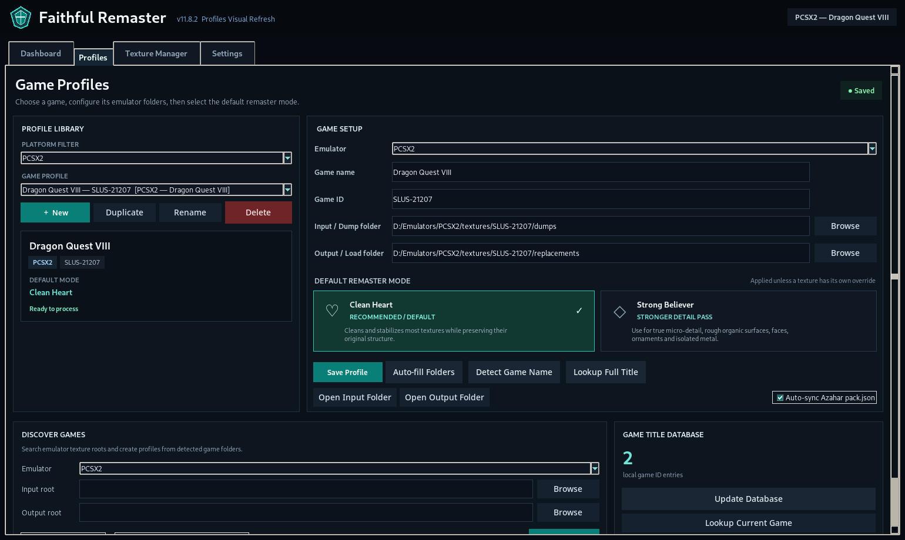
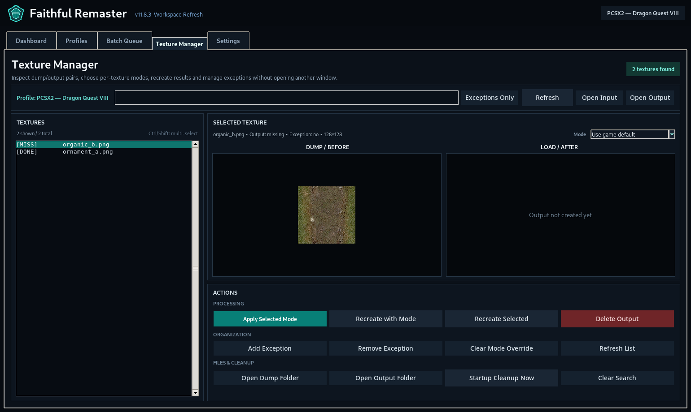
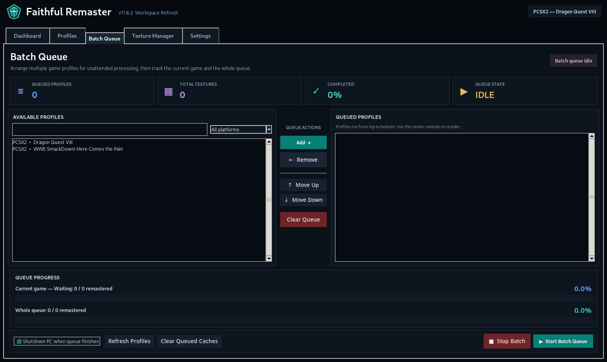

# Faithful Remaster v11.10.22

**Faithful Remaster** is a Windows texture-remastering workspace for emulator texture packs. It watches texture dump folders, sends RGB and Alpha work through replaceable ComfyUI workflows, writes the finished files into the emulator's load/replacement folder, and helps you audit what is missing, existing, orphaned, quarantined, cached, or ready for review.

This release is built on **v11.10.21 Version Sync** and focuses on making the project ready for a serious GitHub release: clearer onboarding, stronger tutorial material, release notes, and a stable public-facing README. No bundled workflow JSON files were changed.


## What this tool is for

Faithful Remaster is designed for creators who want to build high-quality faithful texture packs instead of manually dragging hundreds or thousands of dumped textures through a workflow one by one.

Use it when you want to:

- monitor a game's dump folder while playing;
- remaster new dumped textures automatically;
- preserve original filenames and emulator folder structure;
- route RGB textures and Alpha/mask textures safely;
- compare output modes before replacing game textures;
- build multiple game packs through Batch Queue;
- review missing, existing, and orphaned outputs without guessing;
- protect known problematic EFB/cutscene textures from accidental processing.

Faithful Remaster is **not** an emulator, not a model downloader, and not a one-click guarantee that every texture in every game will look perfect. It is a controlled production workspace for texture-pack creation.

## Highlights in the current public package

- **Version Sync**: the UI title, runtime `APP_VERSION`, bundled `VERSION` file, and package name are aligned.
- **Batch Queue navigation**: Stop Batch, Skip to next game, and Previous game are separated so you can recover from bad packs without killing the whole queue.
- **Live Texture Manager refresh**: counters and texture lists update while watching or while Batch Queue is active.
- **Asset Browser filters**: Active textures, Missing output, Existing output, and Orphaned output views.
- **Profile validation**: check paths, workflow routes, processed-log target, and cache state before starting.
- **Azahar visibility fix**: Azahar metadata actions appear only for Azahar profiles.
- **Alpha route guard**: Alpha/mask processing is protected from being accidentally routed through the wrong workflow.
- **EFB/cutscene quarantine**: bulk quarantine support for dynamic framebuffer/cutscene-like dumps.
- **Workflow modes**: Clean Heart and Strong Believer profiles remain bundled.
- **N64 Strip Safe**: safe routing for thin strip textures.

## Download and run

1. Download the Windows ZIP from the GitHub release.
2. Extract the ZIP into a normal folder, for example:

```text
D:\Tools\Faithful Remaster\
```

3. Run:

```text
Faithful Remaster.exe
```

If Windows blocks the app because it is an unsigned build, choose **More info → Run anyway** only if you downloaded it from the official release page.

## 5-minute first test

1. Start ComfyUI and confirm the API is reachable at:

```text
http://127.0.0.1:8188
```

2. Open Faithful Remaster.
3. Go to **Profiles**.
4. Create or discover a game profile.
5. Set the emulator **Dump** folder and **Load/Replacement** folder.
6. Choose the bundled RGB and Alpha API workflows.
7. Press **Validate Profile**.
8. Press **Test ComfyUI**.
9. Enable texture dumping in your emulator and play until some textures appear.
10. Return to Faithful Remaster and press **Start Watching**.

For the full walkthrough, read [`docs/GETTING_STARTED_TUTORIAL.md`](docs/GETTING_STARTED_TUTORIAL.md).

## Required ComfyUI setup

The bundled workflows expect a working ComfyUI installation and specific model files. Faithful Remaster does not include ComfyUI, checkpoints, ControlNet models, or upscaler weights.

Default local backend:

```text
Local ComfyUI API: http://127.0.0.1:8188
```

Required files for the bundled v11.10.22 workflows:

```text
ComfyUI/models/upscale_models/4x-UltraSharpV2.safetensors
ComfyUI/models/upscale_models/RealESRGAN_x4plus.safetensors
ComfyUI/models/controlnet/controlnet-tile-sdxl-1.0.safetensors
ComfyUI/models/checkpoints/dreamshaperXL_lightningDPMSDE.safetensors
```

Read the full requirement table before processing:

- [`docs/COMFYUI_MODEL_REQUIREMENTS.md`](docs/COMFYUI_MODEL_REQUIREMENTS.md)
- [`docs/setup_comfy.md`](docs/setup_comfy.md)
- [`docs/GETTING_STARTED_TUTORIAL.md`](docs/GETTING_STARTED_TUTORIAL.md)

Note: the bundled RGB workflows currently reference `dreamshaperXL_lightningDPMSDE.safetensors`. If you want to use Juggernaut XL instead, install it as a checkpoint and update/export the workflow so the API workflow points to the Juggernaut filename.


## Emulator folder layouts

Faithful Remaster needs a dump folder and a load/replacement folder. The exact names differ by emulator:

| Emulator | Dump folder | Load / replacement folder |
|---|---|---|
| Dolphin | `Dump\Textures\<GAME_ID>` | `Load\Textures\<GAME_ID>` |
| Azahar / Citra-style | `dump\textures\<TITLE_ID>` | `load\textures\<TITLE_ID>` |
| PCSX2 | `textures\<SERIAL>\dumps` | `textures\<SERIAL>\replacements` |
| DuckStation | `textures\<SERIAL>\dumps` | `textures\<SERIAL>\replacements` |
| PPSSPP | `PSP\TEXTURES\<GAME_ID>\new` | `PSP\TEXTURES\<GAME_ID>` |
| Flycast | `data\texdump\<GAME_ID>` | `data\textures\<GAME_ID>` |

Read [`docs/setup_emulators.md`](docs/setup_emulators.md) for emulator-specific notes.

## Main workflow

### 1. Profiles

Profiles tell Faithful Remaster where a game dumps textures, where finished textures should be written, and which workflows should be used.



Recommended profile setup:

- Use **Discover Games** when possible.
- Confirm that Dump and Load/Replacement paths are different and correct.
- Keep RGB and Alpha workflow routes explicit.
- Press **Validate Profile** before processing.
- For Azahar, use metadata refresh only when the profile is actually an Azahar profile.

### 2. Texture Manager / Asset Browser

Texture Manager is your inspection center.



Use it to:

- see active dumped textures;
- filter missing vs existing outputs;
- find orphaned replacement files;
- preview textures before processing;
- compare modes for a single selected texture;
- refresh or rely on live auto-refresh while watching.

### 3. Watching

Watching is for live pack building. Start the game, let the emulator dump textures, then let Faithful Remaster process new textures as they appear.

Recommended watching approach:

- test on one small area first;
- inspect output in-game;
- only then continue longer sessions;
- quarantine cutscene/EFB-like textures when needed;
- avoid changing workflows mid-run unless you know why.

### 4. Batch Queue

Batch Queue is for processing multiple profiles without babysitting every game.



Controls are intentionally separated:

- **Stop Batch**: stop the whole queue.
- **Skip to next game**: stop the current profile and advance forward.
- **Previous game**: stop the current profile and go back one queued profile.

The queue keeps existing outputs, processed logs, and hash cache intact.

## Recommended release validation before publishing

Before making a public GitHub release, run this checklist:

- Open the app and confirm the header shows `v11.10.22`.
- Confirm the package ZIP filename also says `v11.10.22`.
- Create a temporary profile and run **Validate Profile**.
- Test ComfyUI connection.
- Process 3-5 RGB textures.
- Process or skip at least one Alpha/mask texture.
- Check Texture Manager counters while watching.
- Test Batch Queue with two small profiles.
- Press **Skip to next game** during a controlled run.
- Press **Previous game** during a controlled run.
- Confirm no workflow JSON files were unintentionally modified.


## Troubleshooting

Start with [`docs/troubleshooting.md`](docs/troubleshooting.md). The most common issues are:

- ComfyUI is not running or is using a different API URL.
- The emulator is dumping to a different folder than the profile expects.
- Custom texture loading is disabled in the emulator.
- A save state is showing old texture state.
- A workflow is missing a model or custom node.
- A dynamic EFB/cutscene texture needs quarantine instead of remastering.

## Safety and project policy

Faithful Remaster tries to be conservative by default:

- It preserves filenames and relative paths.
- It does not move original dumps unless you explicitly use a management action.
- It keeps processed logs and cache separate from emulator folders.
- It treats workflow files as replaceable assets.
- It avoids mixing Alpha/mask and RGB routes.

Always keep backups of important texture packs before large processing sessions.

## Files included for this release

- `README.md` — public GitHub front page.
- `CHANGELOG.md` — release history.
- `RELEASE_NOTES_v11.10.22.md` — clean release notes.
- `docs/GETTING_STARTED_TUTORIAL.md` — full tutorial.

## Version lineage

This package is built from v11.10.21 and preserves the recent stability chain:

- v11.10.16 live Texture Manager refresh.
- v11.10.17 UI version and Azahar visibility fix.
- v11.10.19 Batch Queue Skip hardening.
- v11.10.20 Previous game navigation.
- v11.10.21 Version Sync.
- v11.10.22 GitHub release documentation and tutorial package.
