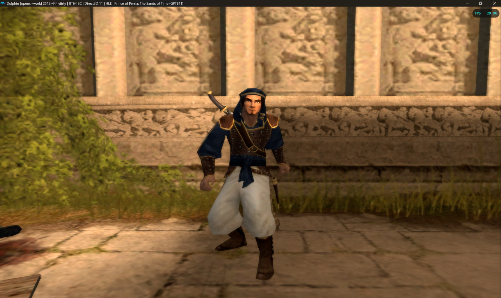
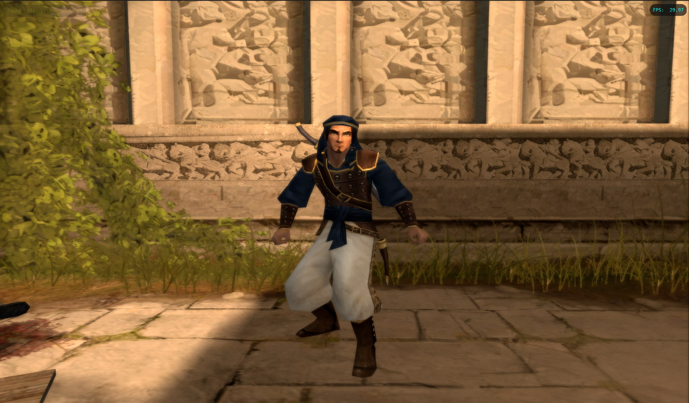
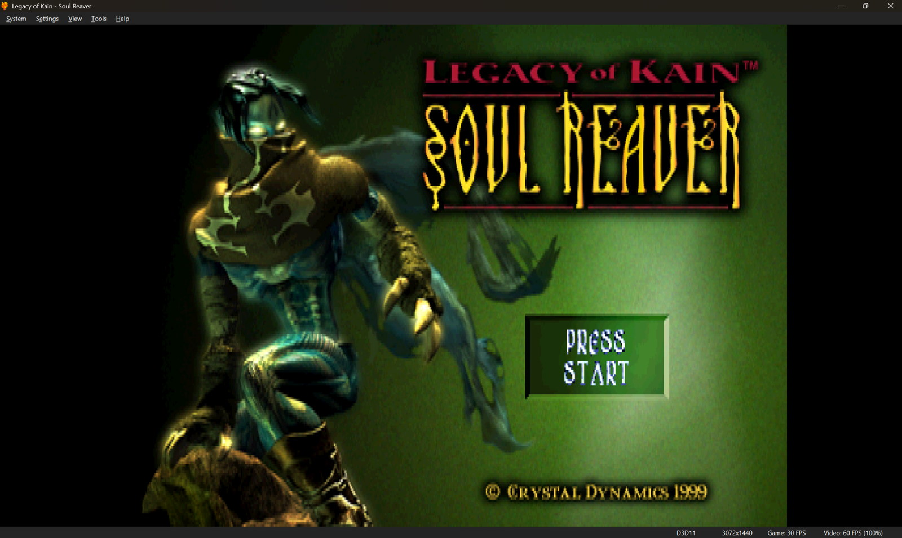
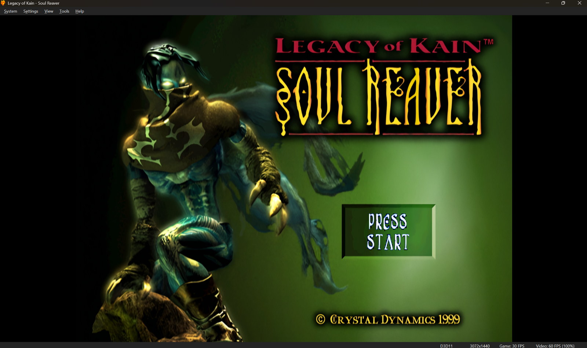

# Faithful Remaster

**Live AI-assisted texture remastering for emulators using ComfyUI.**

Faithful Remaster watches emulator texture-dump folders, processes new textures through ComfyUI, preserves transparency through a separate alpha workflow, and writes enhanced textures directly to emulator replacement folders.

> **Current release:** v11.5.2 Beta

## Highlights

- Live texture-folder monitoring
- RGB and separate alpha ComfyUI workflows
- Separate alpha workflow enabled by default for new profiles
- Fixed-size Original / Enhanced live preview
- Monitor tab with integrated logs
- Inline ComfyUI status beside **Check Comfy Now**
- ComfyUI URL, response time, queue status, and failure reason shown without switching tabs
- Emulator-filtered per-game profiles
- Game name + game ID in profile labels
- Dolphin, PPSSPP, and Azahar path handling
- Azahar `pack.json` synchronization
- Persistent settings, profiles, database, cache, and logs in `%APPDATA%\Faithful Remaster`


## Before / After examples

Real emulator captures across Dolphin, DuckStation, PCSX2, and PPSSPP:

<table>
  <tr>
    <th width="50%">Original</th>
    <th width="50%">Faithful Remaster</th>
  </tr>
  <tr>
    <td></td>
    <td></td>
  </tr>
</table>

<table>
  <tr>
    <th width="50%">Original</th>
    <th width="50%">Faithful Remaster</th>
  </tr>
  <tr>
    <td></td>
    <td></td>
  </tr>
</table>

[View the full comparison gallery](docs/COMPARISONS.md)

## Supported emulators

- Dolphin
- DuckStation
- PCSX2
- PPSSPP
- Azahar / Citra
- Generic folder mapping for experimental emulators

## Quick start

1. Install Python 3.10 or newer.
2. Run `pip install -r requirements.txt`.
3. Start ComfyUI and install the required models.
4. Run `run_gui.bat`.
5. Select an emulator, create a game profile, and choose the Dump and Load folders.
6. Select the bundled API workflows and press **Auto Detect All Nodes**.
7. Press **Check Comfy Now**; the status appears beside the button.
8. Press **Start Watching**.

## Required models

Models are not included.

- `4x-UltraSharpV2.safetensors`
- `controlnet-tile-sdxl-1.0.safetensors`
- `dreamshaperXL_lightningDPMSDE.safetensors`

## Persistent data

User data is stored in:

```text
%APPDATA%\Faithful Remaster
```

New versions reuse the same settings, profiles, title database, cache, logs, and processed history.

## Community testing and workflow development

This is a beta release. Contributions are especially welcome for:

- Testing additional games and emulators
- Improving the RGB ComfyUI workflow
- Improving alpha preservation
- Comparing checkpoints, upscalers, ControlNet strength, samplers, and denoise values
- Reporting reproducible folder, loading, or image-quality issues

Pull requests and workflow experiments are welcome. Do not upload ROMs, ISOs, copyrighted texture packs, or model weights.

## License

MIT License.
